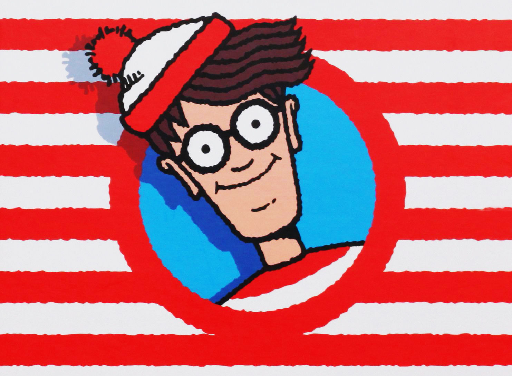
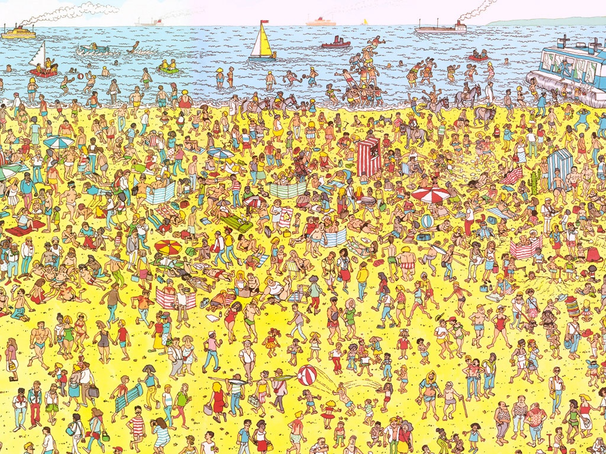
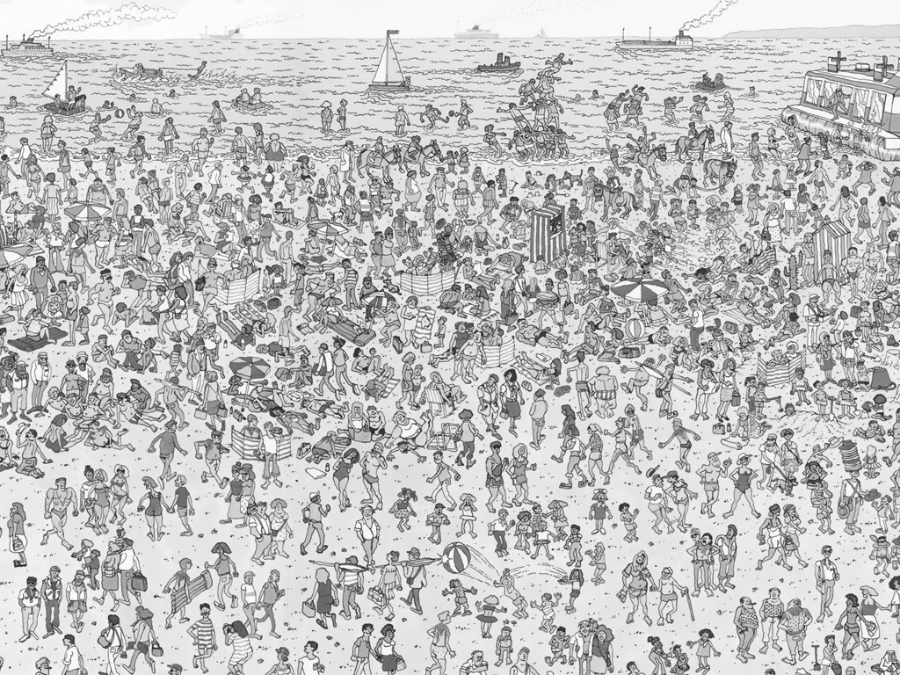
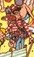

# Object Dection Project Using OpenCV 
***
<div align="center">
  
</div>

***

> This project matches Template Matching technique for object detecting by detection of template image over base image.


## CODE 
<samp>Importing OpenCV</samp>
```python
import cv2 as cv
```
<samp>Loading base image and template image using `cv.imread()`</samp>
Base Image

<table>
<tr>
    <td>
        <b>Input Image</b>
    </td>
    <td>
        <b>Grayscaled</b>
    </td>
    <td>
        <b>Template Image</b>
    </td>
</tr>
<tr>
    <td>
    
    </td>
    <td>
    
    </td>
    <td>
    
    </td>
</tr>
</table>

```python
img = cv.imread(r'D:\projects\AI-ML-MINI-PROJECT-2\Pratham\images\wheres_waldo.jpg')

img_gray = cv.cvtColor(img, cv.COLOR_BGR2GRAY)

template = cv.imread(r'D:\projects\AI-ML-MINI-PROJECT-2\Pratham\images\temp.jpg',0)
```

Getting the height and width of the template image using `.shape` method.
```python
h ,w = template.shape
```
`cv.matchTemplate` is used to comapare images. It gives a 2D-array as output. 
```python
match = cv.matchTemplate(img_gray,template,cv.TM_CCOEFF_NORMED)
threshold = 0.99
```

```py
min_val, max_val, min_location, max_location = cv.minMaxLoc(match)
location = max_location
font = cv.FONT_HERSHEY_PLAIN
cv.rectangle(img, location, (location[0] + w, location[1] + h), (0,0,255), 2)
cv.putText(img,"Waldo Spotted.", (location[0]-40,location[1]-5),font , 1, (0,0,0),2)

cv.imwrite('AI-ML-MINI-PROJECT-2\Pratham\grayscale.jpg',img_gray)
cv.imshow('grayscale.jpg',img_gray)
cv.imwrite('AI-ML-MINI-PROJECT-2\Pratham\Results.jpg',img)
cv.imshow('Results.jpg',img)

cv.waitKey(0)
cv.destroyAllWindows()

```


